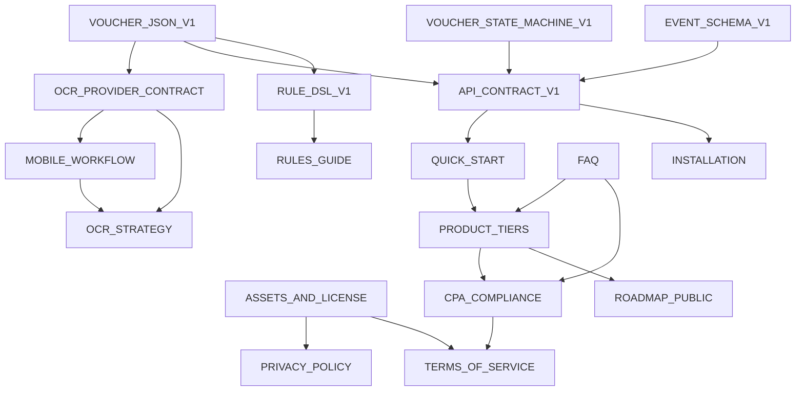

# 湛箴文档体系蓝图

> **文档版本**：v0.1  
> **更新日期**：2026-08-25  
> **状态**：草稿（待团队评审）  
> **命名约定**：全部 `docs/` 目录下，`UPPER_SNAKE_CASE.md`，英文名+中文标题，版本号在文档内首行

---

## 1. 文档分类总览

| 类别 | 目录 | 面向受众 | 更新频率 |
|------|------|----------|----------|
| **规格类** | `docs/specs/` | 架构师、后端、QA、合规 | 重大变更才改 |
| **用户类** | `docs/user/` | 最终用户、会计师、销售 | 版本发布同步 |
| **开发类** | `docs/dev/` | 贡献者、外包、新入职 | 持续迭代 |
| **合规商业类** | `docs/biz/` | 创始人、法务、投资人、销售 | 战略调整时 |

---

## 2. 完整文档目录树

```
docs/
├── # ===== 规格类 =====
│   ├── specs/
│   │   ├── VOUCHER_JSON_V1.md           # 凭证 JSON Schema v1（已有，action-tree/specs/voucher-json-v1.md 同步）
│   │   ├── VOUCHER_STATE_MACHINE_V1.md  # 凭证状态机（已有，action-tree/specs/voucher-state-machine-v1.md 同步）
│   │   ├── EVENT_SCHEMA_V1.md           # 事件溯源 Schema（已有，action-tree/specs/event-schema-v1.md 同步）
│   │   ├── RULE_DSL_V1.md               # 规则 DSL 语法（待写，action-tree/docs/05_Audit_Rule_Engine.md 衍生）
│   │   ├── OCR_PROVIDER_CONTRACT.md     # OCR Provider 契约（zhanzhen/ocr.py 实现对应）
│   │   └── API_CONTRACT_V1.md           # REST API OpenAPI 契约（server 生成）
│
├── # ===== 用户类 =====
│   ├── user/
│   │   ├── QUICK_START.md               # 5 分钟上手（Windows/Mac/Linux/Android）
│   │   ├── INSTALLATION.md              # 详细安装指南（pip/APK/Docker/源码）
│   │   ├── MOBILE_WORKFLOW.md           # 📱 手机拍照→工作台全流程（新增）
│   │   ├── VOUCHER_GUIDE.md             # 凭证录入/导入/分类/覆核操作指南
│   │   ├── REPORT_GUIDE.md              # 报告生成/模板选择/导出指南
│   │   ├── RULES_GUIDE.md               # 3+12 规则含义/阈值调整/自定义规则
│   │   ├── FAQ.md                       # 常见问题（分类：安装/OCR/同步/计费/合规）
│   │   ├── TROUBLESHOOTING.md           # 故障排查（日志/报错码/网络/权限）
│   │   └── CHANGELOG.md                 # 用户可见变更日志（从 VERSIONING.md 衍生）
│
├── # ===== 开发类 =====
│   ├── dev/
│   │   ├── ARCHITECTURE.md              # 系统架构总览（已有，根目录 ARCHITECTURE.md 同步）
│   │   ├── CONTRIBUTING.md              # 贡献指南（分支/Commit/PR/测试/代码风格）
│   │   ├── DEVELOPMENT_SETUP.md         # 本地开发环境搭建（pre-commit/venv/Docker）
│   │   ├── TESTING_STRATEGY.md          # 测试金字塔/契约测试/黄金数据集/覆盖率门槛
│   │   ├── ADR/                         # 架构决策记录
│   │   │   ├── ADR-001_DEBIT_CREDIT.md  # 借贷双列决策（已有，action-tree/docs/adr/ADR-001.md）
│   │   │   ├── ADR-002_YAML_DSL.md      # YAML DSL 为唯一准则
│   │   │   ├── ADR-003_MULTI_REPO.md    # 不合并仓库、契约收敛
│   │   │   ├── ADR-004_RLS_TENANT.md    # PostgreSQL RLS 多租户隔离
│   │   │   └── ADR-005_OCR_FALLBACK.md  # 三级降级链选型
│   │   ├── PLUGIN_DEVELOPMENT.md        # DSH 插件开发规范（hermes dsh-plugins 分支）
│   │   ├── RELEASE_PROCESS.md           # 发布流程（语义化版本/Changelog/标签/二进制）
│   │   └── SECURITY.md                  # 安全报告流程/依赖扫描/密钥管理
│
├── # ===== 合规商业类 =====
│   ├── biz/
│   │   ├── OCR_STRATEGY.md              # OCR 三级降级链+License（本批新增）
│   │   ├── PRODUCT_TIERS.md             # 免费/专业版切分+CPA边界+定价（本批新增）
│   │   ├── ASSETS_AND_LICENSE.md        # 资产分层+Open Core 双轨（本批新增）
│   │   ├── CPA_COMPLIANCE.md            # 执业边界细则/免责声明/合规清单（新增）
│   │   ├── ROADMAP_PUBLIC.md            # 对外公开路线图（v0.2→v1.0，新增）
│   │   ├── PRIVACY_POLICY.md            # 隐私政策（GDPR/个保法，新增）
│   │   ├── TERMS_OF_SERVICE.md          # 服务条款（订阅/退款/SLA，新增）
│   │   ├── DATA_PROCESSING_ADDENDUM.md  # DPA 数据处理协议（企业客户，新增）
│   │   └── LIMITATIONS.md               # 已知限制/不做项（已有根目录，同步）
│
├── # ===== 根目录现有文档（保持同步）=====
│   ├── BRAND_OCTOPUS.md                 # 品牌/图标/提示词（已有）
│   ├── REPORT_KNOWLEDGE.md              # 报告知识库（已有）
│   ├── ARCHITECTURE.md                  # 架构总览（根目录，软链接到 docs/dev/）
│   ├── LIMITATIONS.md                   # 已知限制（根目录，软链接到 docs/biz/）
│   └── VERSIONING.md                    # 版本路线图（根目录）
```

---

## 3. 文档详细清单

| 路径 | 职责 | 状态 | 依赖上游 | 维护责任人 |
|------|------|------|----------|------------|
| `docs/specs/VOUCHER_JSON_V1.md` | 凭证数据契约，前后端/移动端/导入器的唯一真相源 | ✅ 已有 | action-tree/specs/voucher-json-v1.md | 架构师 |
| `docs/specs/VOUCHER_STATE_MACHINE_V1.md` | 凭证生命周期状态迁移规则（草稿→待复核→已复核→已入账→作废） | ✅ 已有 | action-tree/specs/voucher-state-machine-v1.md | 架构师 |
| `docs/specs/EVENT_SCHEMA_V1.md` | EventLog 事件溯源结构，审计追踪基石 | ✅ 已有 | action-tree/specs/event-schema-v1.md | 架构师 |
| `docs/specs/RULE_DSL_V1.md` | YAML 规则语法、算子、上下文变量、测试用例格式 | ⏳ 待写 | action-tree/docs/05_Audit_Rule_Engine.md | 规则引擎 Owner |
| `docs/specs/OCR_PROVIDER_CONTRACT.md` | OCR Provider 接口定义、错误码、降级协议 | 📝 进行中 | zhanzhen/ocr.py | OCR Owner |
| `docs/specs/API_CONTRACT_V1.md` | OpenAPI 3.1 规范，前端/移动端/三方集成契约 | ⏳ 待写 | server 生成 | 后端 Owner |
| `docs/user/QUICK_START.md` | 5 分钟跑通：安装→录入→覆核→报告 | ⏳ 待写 | 所有核心功能 | 产品/文档 |
| `docs/user/INSTALLATION.md` | 详细安装：pip/uv/Docker/APK/源码构建/Windows 绿色版 | ⏳ 待写 | 打包发布流程 | 发布工程师 |
| `docs/user/MOBILE_WORKFLOW.md` | **手机拍照→采集包→工作台导入→OCR→分类→底稿**全链路 | 📝 进行中 | OCR_STRATEGY.md, zhanzhen/ocr.py | 移动端 Owner |
| `docs/user/VOUCHER_GUIDE.md` | 凭证手工/CSV/OCR 录入、分类模板、覆核标记、批量操作 | ⏳ 待写 | 核心功能 | 产品 |
| `docs/user/REPORT_GUIDE.md` | 报告模板选择、AI 起草、导出 PDF/Word/HTML、版本管理 | ⏳ 待写 | 专业模板包 | 产品 |
| `docs/user/RULES_GUIDE.md` | 3+12 规则逐条解释、阈值调整、自定义规则 DSL 示例 | ⏳ 待写 | RULE_DSL_V1.md | 规则引擎 Owner |
| `docs/user/FAQ.md` | 分类 FAQ：安装/OCR/同步/计费/合规/数据导出 | ⏳ 待写 | 收集真实问题 | 客服/产品 |
| `docs/user/TROUBLESHOOTING.md` | 报错码对照表、日志分析、网络/权限/存储常见故障 | ⏳ 待写 | 错误码规范 | QA |
| `docs/user/CHANGELOG.md` | 用户可见变更（从 VERSIONING.md 衍生，去技术细节） | ⏳ 待写 | VERSIONING.md | 发布工程师 |
| `docs/dev/ARCHITECTURE.md` | 系统全景：模块/数据流/部署/技术选型/非功能性指标 | ✅ 已有 | — | 架构师 |
| `docs/dev/CONTRIBUTING.md` | 分支策略、Commit 规范、PR 模板、测试要求、Code Review 清单 | ⏳ 待写 | — | 维护者 |
| `docs/dev/DEVELOPMENT_SETUP.md` | 本地环境：Python/Node/uv/Docker/pre-commit/IDE 配置 | ⏳ 待写 | — | 维护者 |
| `docs/dev/TESTING_STRATEGY.md` | 单元/集成/契约/E2E/黄金数据集/覆盖率门槛/CI 矩阵 | ⏳ 待写 | 测试基建 | QA |
| `docs/dev/ADR/*.md` | 架构决策记录（背景/决策/后果/替代方案） | 📝 部分 | — | 架构师 |
| `docs/dev/PLUGIN_DEVELOPMENT.md` | DSH 插件规范：manifest/入口/权限/发布/版本兼容 | ✅ 已有 | hermes dsh-plugins 分支 | 插件 Owner |
| `docs/dev/RELEASE_PROCESS.md` | 语义化版本、Changelog 生成、Git 标签、二进制/APK/镜像发布 | ⏳ 待写 | CI/CD | 发布工程师 |
| `docs/dev/SECURITY.md` | 安全报告邮箱、依赖扫描、密钥轮换、渗透测试节奏 | ⏳ 待写 | — | 安全 Owner |
| `docs/biz/OCR_STRATEGY.md` | **OCR 三级降级链、各方案 License、接口规范** | ✅ 本批完成 | — | OCR Owner |
| `docs/biz/PRODUCT_TIERS.md` | **免费/专业版切分、CPA 签发边界、免责声明、定价** | ✅ 本批完成 | action-tree/docs/11/10/12 | 产品/法务 |
| `docs/biz/ASSETS_AND_LICENSE.md` | **资产分类表、Open Core 双轨、用户数据权利、商标** | ✅ 本批完成 | action-tree/docs/15/10/12 | 创始人/法务 |
| `docs/biz/CPA_COMPLIANCE.md` | 执业边界细则、免责声明模板、合规检查清单、审计准则映射 | 📝 进行中 | PRODUCT_TIERS.md, 法律顾问 | 法务/产品 |
| `docs/biz/ROADMAP_PUBLIC.md` | 对外公开路线图：v0.2~v1.0 里程碑、功能承诺、时间窗口 | 📝 进行中 | VERSIONING.md, 内部 OKR | 创始人/产品 |
| `docs/biz/PRIVACY_POLICY.md` | GDPR/个保法合规隐私政策（数据收集/用途/共享/权利/联系人） | ⏳ 待写 | ASSETS_AND_LICENSE.md | 法务 |
| `docs/biz/TERMS_OF_SERVICE.md` | 订阅条款、退款政策、SLA、免责、争议解决、知识产权 | ⏳ 待写 | PRODUCT_TIERS.md | 法务 |
| `docs/biz/DATA_PROCESSING_ADDENDUM.md` | 企业客户 DPA：数据处理者义务、分包商、跨境传输、审计权 | ⏳ 待写 | PRIVACY_POLICY.md | 法务 |
| `docs/biz/LIMITATIONS.md` | 已知限制、不做项、技术债、规模边界 | ✅ 已有 | — | 架构师/产品 |

---

## 4. 文档依赖关系图



---

## 5. 维护规范

| 规则 | 说明 |
|------|------|
| **单一真相源** | 规格类文档以 `action-tree/specs/` 为准，`docs/specs/` 仅镜像/软链接 |
| **版本同步** | 文档版本随代码语义化版本发布（`CHANGELOG.md` 记录文档变更） |
| **必有示例** | 面向用户/开发者的文档必须包含可运行示例（命令/代码/截图） |
| **交叉引用** | 文档间引用使用相对路径 `[标题](../specs/VOUCHER_JSON_V1.md)` |
| **语言** | 正文中文，代码/接口/错误码保留英文，关键术语中英对照 |
| **审核** | 合规商业类文档发布前需法务/创始人确认签字 |

---

## 6. 新增文档优先级（本批已完成 3 个）

| 优先级 | 文档 | 目标完成 | 阻塞项 |
|--------|------|----------|--------|
| **P0** | `docs/biz/OCR_STRATEGY.md` | ✅ 完成 | — |
| **P0** | `docs/biz/PRODUCT_TIERS.md` | ✅ 完成 | — |
| **P0** | `docs/biz/ASSETS_AND_LICENSE.md` | ✅ 完成 | — |
| **P0** | `docs/user/MOBILE_WORKFLOW.md` | 📝 进行中 | OCR_STRATEGY.md, 移动端代码 |
| **P1** | `docs/biz/CPA_COMPLIANCE.md` | 下周 | 法律顾问宅核 |
| **P1** | `docs/biz/ROADMAP_PUBLIC.md` | 下周 | 内部 OKR 对齐 |
| **P1** | `docs/specs/RULE_DSL_V1.md` | 两周内 | 规则引擎重构 |
| **P2** | `docs/user/QUICK_START.md` | v0.2 发布前 | 打包发布就绪 |
| **P2** | `docs/dev/CONTRIBUTING.md` | 社区开放前 | 分支策略定稿 |
| **P2** | `docs/biz/PRIVACY_POLICY.md` | 专业版上线前 | 法务起草 |
| **P2** | `docs/biz/TERMS_OF_SERVICE.md` | 专业版上线前 | 法务起草 |

---

## 7. 文档发布渠道

| 受众 | 渠道 | 同步方式 |
|------|------|----------|
| **开发者/贡献者** | GitHub 仓库 `docs/` | 代码同步，PR 审核 |
| **最终用户** | 官网 `/docs/`、App 内帮助中心 | CI 部署（VitePress/Docusaurus） |
| **销售/售前** | Notion/飞书知识库 | 手动同步关键商业文档 |
| **投资人/合规审计** | 数据室（VDR） | 导出 PDF 打包 |
| **监管/审计** | 合规文档包 | 定版归档（Git 标签 + PDF） |

---

## 8. 相关文件位置

| 内容 | 仓库路径 |
|------|----------|
| 规格权威源 | `Ya-MiC/action-tree/specs/` |
| 商业/合规权威源 | `Ya-MiC/action-tree/docs/10-15.md` |
| 核心引擎代码 | `Ya-MiC/zhanzhen/zhanzhen/` |
| 服务端代码 | `Ya-MiC/zhanzhen-server/server/` |
| DSH 插件规范 | `Ya-MiC/hermes` (dsh-plugins 分支) |
| 移动端代码 | `Ya-MiC/audit-os-mobile/` |
| CLI 参考实现 | `Ya-MiC/audit-os/` |

---

> **维护提示**：本文档（`DOC_MAP.md`）作为文档体系的「地图」，每次新增/归档/重组文档时**必须同步更新本表**，保持目录树、清单、依赖图一致。