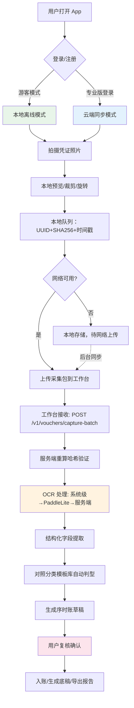

# 移动端全流程：手机拍照 → 工作台

> **文档版本**：v0.1  
> **更新日期**：2026-08-25  
> **状态**：草稿（待团队评审）  
> **上游依据**：`docs/OCR_STRATEGY.md`、`docs/PRODUCT_TIERS.md`、`zhanzhen/ocr.py`、`audit-os-mobile/README.md`

---

## 1. 总体流程图



---

## 2. 详细步骤拆解

### 2.1 采集端（Android App / audit-os-mobile）

| 步骤 | 交互 | 技术实现 | 关键点 |
|------|------|----------|--------|
| **1. 进入拍摄** | 点击「拍凭证」浮动按钮 | `MainActivity` + `ZhanZhenBridge.openCamera()` JS 桥 | **零 CAMERA 权限**——委托系统相机 App |
| **2. 拍摄照片** | 系统相机界面，对准拍摄 | `MediaStore.ACTION_IMAGE_CAPTURE` Intent | 照片存入应用私有目录，不污染相册 |
| **3. 预览确认** | 缩略图列表，可删可重拍 | `RecyclerView` + `Glide` 加载 | 本地队列持久化 (`Room`/`DataStore`) |
| **4. 元数据记录** | 自动生成 | 每张照片：`uuid`、`sha256`、`timestamp`、`device_id`、`gps(可选)` | SHA256 客户端计算，**服务端重算不信任客户端** |
| **5. 导出采集包** | 点击「上传到工作台」 | 生成 `zhanzhen-capture-<timestamp>.json` | 含：照片 base64 + 元数据数组，单文件 < 50 MB |
| **6. 上传传输** | HTTPS POST | `Retrofit` + `OkHttp` 分片上传（大文件） | 专业版：直传 MinIO 预签名 URL；免费版：走 API 网关 |

**采集包 JSON 结构**：
```json
{
  "version": "1.0",
  "exported_at": "2026-08-25T10:30:00+08:00",
  "device": { "brand": "Xiaomi", "model": "Mi 13", "os": "Android 14" },
  "app_version": "0.4.0",
  "items": [
    {
      "file_id": "vou_01JX...",
      "sha256": "a3f2...",
      "filename": "vou_01JX..._page1.jpg",
      "mime_type": "image/jpeg",
      "captured_at": "2026-08-25T10:28:12+08:00",
      "content_base64": "/9j/4AAQSkZJRgABAQ...",
      "voucher_type_hint": "vat_invoice"
    }
  ]
}
```

### 2.2 工作台接收端（zhanzhen / zhanzhen-server）

| 端点 | 方法 | 说明 |
|------|------|------|
| `/v1/vouchers/capture-batch` | POST | 接收采集包，**服务端重算 SHA256** 验证完整性 |
| `/v1/uploads/initiate` | POST | 大文件分片上传初始化（专业版直传 MinIO） |
| `/v1/uploads/{id}/parts/{n}` | PUT | 分片上传 |
| `/v1/uploads/{id}/complete` | POST | 完成分片合并 |

**接收处理流程**：
```python
# 伪代码：server/api/routes/vouchers.py
@router.post("/capture-batch")
async def receive_capture_batch(batch: CaptureBatchRequest, tenant=Depends(get_tenant)):
    # 1. 逐项验证 SHA256
    for item in batch.items:
        computed = sha256(base64_decode(item.content_base64)).hexdigest()
        if computed != item.sha256:
            raise HTTPException(400, f"Hash mismatch: {item.file_id}")
    
    # 2. 存储到 MinIO（对象键：tenants/{tid}/captures/{batch_id}/{file_id}.jpg）
    file_refs = await minio_client.batch_upload(batch.items)
    
    # 3. 创建 Voucher 记录（状态=DRAFT，source=MOBILE_CAPTURE）
    vouchers = await voucher_service.create_from_capture(tenant.id, file_refs, batch.items)
    
    # 4. 触发 OCR Job（异步）
    for v in vouchers:
        await ocr_queue.enqueue(v.id, priority="normal" if tenant.is_pro else "low")
    
    return {"batch_id": batch_id, "voucher_ids": [v.id for v in vouchers], "status": "queued"}
```

### 2.3 OCR 处理管线（三级降级链）

详见 `docs/OCR_STRATEGY.md`，此处仅列移动端相关差异：

| 场景 | 免费版 | 专业版 |
|------|--------|--------|
| **单张凭证** | 端侧系统级 OCR → PaddleLite | 端侧同免费版 + 可选服务端高精度 |
| **批量 (≤10 张)** | 端侧顺序处理 | 服务端并行批量（队列优先级高） |
| **批量 (>10 张)** | 提示升级专业版 | 服务端分批处理，进度回调 |
| **复杂版面/手写** | 端侧尽力，标记低置信度 | 服务端完整模型 + 布局分析 |
| **PDF 多页** | 仅文本层提取 | 逐页渲染图片 → 全管线 OCR |

### 2.4 结构化字段 → 分类模板 → 序时账草稿

```
OCR 原始输出 (VoucherJSON v1)
       │
       ▼
字段归一化：
  - 金额：统一为分(整数)/元(两位小数)
  - 日期：ISO 8601 (YYYY-MM-DD)
  - 税号：去除空格/连字符，大写
  - 名称：去除前后缀「有限公司」等标准化
       │
       ▼
分类模板库匹配 (rules_builtin.yaml -> voucher_templates:)
  增值税专用发票  -> 模板: vat_special (科目: 应收账款/主营业务收入/应交税费)
  增值税普通发票  -> 模板: vat_normal  (科目: 管理费用/应交税费)
  银行回单       -> 模板: bank_receipt (科目: 银行存款/财务费用)
  报销单/费用票   -> 模板: expense      (科目: 对应费用科目/应付职工薪酬)
  其他           -> 模板: generic      (人工指定)
       │
       ▼
生成序时账草稿 (JournalDraft):
  - 分录行：借/贷科目、金额、摘要、辅助核算
  - 关联凭证：voucher_id、page_no
  - 状态：DRAFT（待用户复核确认）
```

---

## 3. 离线优先与同步策略

| 场景 | 行为 |
|------|------|
| **完全离线拍摄** | 照片入本地队列，本地 SQLite 持久化，显示「待同步」徽章 |
| **弱网上传** | 分片上传，支持断点续传，指数退避重试 |
| **冲突处理** | 乐观锁：`version` 字段，冲突时保留服务端版本，本地变更生成冲突副本供用户合并 |
| **多设备同步** | 专业版：云端账套为准，本地只做缓存；免费版：仅导出/导入采集包手动迁移 |

---

## 4. 权限与隐私设计

| 权限 | 是否申请 | 理由 |
|------|----------|------|
| `CAMERA` | ❌ **不申请** | 委托系统相机 App，用户信任自己的相机 |
| `READ_EXTERNAL_STORAGE` | ❌ 不申请 | 照片存应用私有目录 (`getExternalFilesDir`) |
| `INTERNET` | ✅ | 上传采集包、同步账套 |
| `ACCESS_NETWORK_STATE` | ✅ | 判断网络状态决定同步时机 |
| `FOREGROUND_SERVICE` | ✅ | 大批量上传/下载时前台服务防杀 |

**隐私承诺**：
- GPS 位置**仅在用户明确开启**时记录（用于「在此地拍摄」辅助核对）
- 设备指纹仅用于「受信设备」管理，不上报广告/分析 SDK
- 采集包上传前**本地预览**，用户可删除任意张照片再上传

---

## 5. 专业版增值能力（移动端）

| 能力 | 免费版 | 专业版 |
|------|--------|--------|
| **云端账套同步** | ❌ 仅本地/导出包 | ✅ 实时双向同步 |
| **批量 OCR 队列** | ❌ 单张手动 | ✅ 后台自动批量 |
| **服务端高精度 OCR** | ❌ | ✅ 复杂版面/手写/多页 PDF |
| **AI 智能分类** | ❌ 规则模板匹配 | ✅ 结合历史分类记录微调 |
| **多客户切换** | ❌ 单账套 | ✅ 下拉切换客户/项目 |
| **离线草稿保存天数** | 30 天自动清理 | 永久保留（云端备份） |

---

## 6. 错误码与用户提示

| 错误码 | 场景 | 用户可见提示 | 恢复建议 |
|--------|------|--------------|----------|
| `HASH_MISMATCH` | 服务端 SHA256 校验失败 | 「照片可能损坏，请重新拍摄」 | 重拍 |
| `OCR_UNSUPPORTED` | 端侧无可用 OCR 引擎 | 「当前设备不支持离线识别，请连网使用服务端识别」 | 连网/升级专业版 |
| `QUOTA_EXCEEDED` | 专业版 OCR 配额用尽 | 「本月服务端 OCR 次数已用完，下月 1 日重置」 | 等待重置/购买额度包 |
| `TENANT_FROZEN` | 订阅过期冻结 | 「订阅已过期，仅可查看导出数据」 | 续费恢复 |
| `SERVER_UNAVAILABLE` | 工作台离线/维护 | 「服务暂时不可用，数据已本地保存，稍后自动同步」 | 等待恢复 |

---

## 7. 埋点与分析（产品迭代依据）

| 事件名 | 触发时机 | 关键属性 |
|--------|----------|----------|
| `capture_start` | 点击拍摄按钮 | `source: camera/gallery` |
| `capture_complete` | 照片加入队列 | `file_size`, `dimensions` |
| `batch_export` | 导出采集包 | `item_count`, `total_mb` |
| `batch_upload` | 点击上传 | `network_type`, `is_pro` |
| `ocr_engine_used` | OCR 完成 | `engine: system/paddlelite/server`, `duration_ms`, `confidence` |
| `ocr_fallback` | 发生降级 | `from_engine`, `to_engine`, `reason` |
| `voucher_confirmed` | 用户确认入账 | `auto_classified: true/false`, `template_matched` |
| `sync_conflict` | 同步冲突 | `conflict_type`, `resolution` |

---

## 8. 测试用例清单

| ID | 场景 | 预期结果 |
|----|------|----------|
| MOB-001 | 离线拍摄 5 张 → 联网上传 | 5 张全部上传成功，服务端 SHA256 校验通过 |
| MOB-002 | 弱网分片上传 20 MB 采集包 | 分片全部到达，合并后文件完整 |
| MOB-003 | 免费版端侧 OCR 识别增值税专票 | 字段提取准确率 > 85%，自动匹配 vat_special 模板 |
| MOB-004 | 专业版服务端 OCR 识别手写收据 | 字段提取准确率 > 70%，标记需人工复核 |
| MOB-005 | 批量 20 张上传，专业版并行 OCR | 平均单张 < 3 秒，进度实时回调 |
| MOB-006 | 同一账套手机+电脑同时编辑 | 乐观锁冲突检测，弹出合并对话框 |
| MOB-007 | 订阅过期后尝试上传 | 提示冻结，仅允许导出数据 |
| MOB-008 | 删除本地采集包项后上传 | 仅上传剩余项，服务端不报错 |

---

## 9. 相关文档与代码位置

| 内容 | 路径 |
|------|------|
| OCR 三级降级链设计 | `docs/OCR_STRATEGY.md` |
| 产品分层（专业版权限） | `docs/PRODUCT_TIERS.md` |
| 现有 OCR Provider 架构 | `zhanzhen/ocr.py` |
| 移动端 APK 构建 | `audit-os-mobile/` (raw/main/dist/zhanzhen-v0.3.apk) |
| 服务端接收端点 | `server/api/routes/vouchers.py` (`capture-batch`) |
| OCR Worker | `server/worker/ocr_worker.py` |
| 采集包导入器（待实现） | `zhanzhen/importers/mobile_capture.py` |

---

## 10. 待办事项

- [ ] Android: `ZhanZhenBridge` 完善（相机/相册/文件选择三入口）
- [ ] Android: 采集包导出/分片上传/断点续传
- [ ] 服务端: `capture-batch` 端点实现 + SHA256 校验
- [ ] 服务端: OCR Worker 接入三级降级链调度
- [ ] 分类模板库：`rules_builtin.yaml` 扩展 `voucher_templates` 映射
- [ ] 专业版权限校验中间件（OCR/同步/批量）
- [ ] 埋点上报 SDK 集成（隐私合规）
- [ ] E2E 测试：模拟弱网/离线/冲突/过期全场景